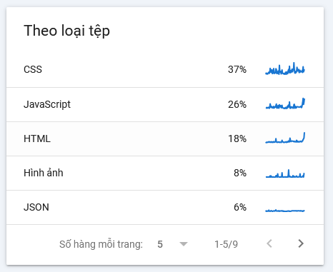

Nếu mục tiêu của bạn là **giảm crawl CSS/JS** để tối ưu tốc độ tải trang và giảm tải cho bot (Googlebot, Bingbot...), **LiteSpeed Cache** cung cấp nhiều tính năng mạnh mẽ để kiểm soát cách các tài nguyên tĩnh như CSS và JS được xử lý.

<!-- truncate -->

---

Dưới đây là các cách **tối ưu LiteSpeed Cache để giảm crawl CSS/JS**:

 

---

### I. Kích hoạt Combine và Minify

Giúp giảm số lượng request và dung lượng file:

- **LiteSpeed Cache > Page Optimization > CSS Settings**
  - ✅ *CSS Minify*: Bật
  - ✅ *CSS Combine*: Bật
  - ✅ *CSS Combine External and Inline*: Bật nếu không gây lỗi

- **LiteSpeed Cache > Page Optimization > JS Settings**
  - ✅ *JS Minify*: Bật
  - ✅ *JS Combine*: Bật
  - ✅ *JS Combine External and Inline*: Bật nếu không gây lỗi

📌 *Lưu ý*: Sau khi bật, kiểm tra kỹ giao diện vì một số theme/plugin có thể bị lỗi khi combine.

---

### II. Tải CSS/JS theo yêu cầu (Lazy Load)

Giúp trì hoãn tải các file không cần thiết ngay lập tức:

- **Load CSS Asynchronously**: Bật
- **JS Deferred**: Bật
- **JS Deferred Excludes**: Thêm các script quan trọng không nên trì hoãn (như jQuery nếu cần)

---

### III. Loại trừ CSS/JS không cần thiết khỏi bot crawl

LiteSpeed hỗ trợ **tối ưu riêng cho bot**:

- **LiteSpeed Cache > Crawler > Optimization Settings**
  - ✅ *Separate View for Bots*: Bật
  - ✅ *Remove Unused CSS for Bots*: Bật
  - ✅ *Remove JS for Bots*: Bật (nếu site không cần JS để hiển thị nội dung chính)

Điều này giúp giảm crawl budget và tăng tốc độ index.

---

### IV. Loại trừ file không cần thiết

Nếu bạn biết rõ file nào không cần thiết, có thể loại trừ:

- **LiteSpeed Cache > Page Optimization > Tuning**
  - *JS Excludes* / *CSS Excludes*: thêm đường dẫn hoặc từ khóa file bạn muốn loại trừ khỏi combine/minify

---

### IV. Tối ưu file Robot.txt

```bash
# ============================
# ROBOTS.TXT  Phien ban an toan
# ============================

# Cho phep tat ca bot index website
User-agent: *
Disallow: /wp-admin/
Allow: /wp-admin/admin-ajax.php

# Chan cac thu muc he thong WordPress khong can SEO
Disallow: /cgi-bin/
Disallow: /trackback/
Disallow: /xmlrpc.php
Disallow: /feed/
Disallow: /comments/
Disallow: /wp-json/
Disallow: /readme.html
Disallow: /license.txt

# Chan cac file dong & tham so tao duplicate content
Disallow: /*.php$
Disallow: /*?s=*
Disallow: /*?replytocom=*
Disallow: *?utm_*
Disallow: *?p=*
Disallow: /tag/
Disallow: /component/*
Disallow: /cdn-cgi/
Disallow: /?__hstc=
Disallow: /?gclid*

# Cho phep Googlebot load CSS, JS, Uploads de render trang
Allow: /wp-content/themes/
Allow: /wp-content/plugins/
Allow: /wp-content/uploads/

# Chan file map, test, docs khong lien quan SEO
Disallow: /*.map$
Disallow: /wp-content/plugins/*/tests/
Disallow: /wp-content/plugins/*/docs/
Disallow: /wp-content/themes/*/docs/

# Sitemap chuan
Sitemap: https://domain-name/sitemap_index.xml
```

### V. Kiểm tra bằng công cụ crawl

Dùng các công cụ như:
- [Google Search Console > Crawl Stats](https://search.google.com/search-console)
- [Screaming Frog SEO Spider](https://www.screamingfrog.co.uk/seo-spider/)

Để xem bot đang crawl những file nào nhiều nhất, từ đó loại trừ hoặc tối ưu thêm.

---