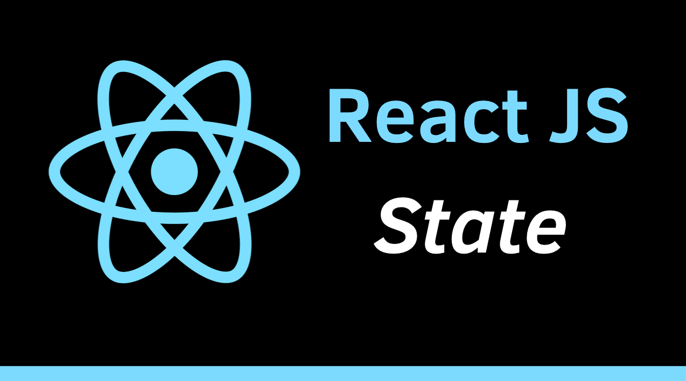

# Import State

Để sử dụng State chúng ta phải tiến hành import hook useState 



<ToggleTOC />

## I. Tạo biến trạng thái

Chúng ta thêm hàm useState từ gói "react". `useState` là một named export có cú pháp thêm là:

```jsx
import {useState} from "react";
```

Nếu bạn đã thêm `React` vào trong cùng một file, bạn có thể kết hợp các lệnh import thành một lệnh import duy nhất. Ví dụ:

```jsx
import React from "react";
import {useState} from "react";
```

2 câu lệnh có thể được kết hợp thành một lệnh import duy nhất:

```jsx
import React, {useState} from "react";
```

## II. Lưu ý 

- `React` là default export (không có dấu ngoặc nhọn)
- `useState` là named export (được đóng gói trong dấu ngoặc nhọn)
- `useState` là một trong nhiều hook được cung cấp bởi React.

:::tip[Tóm lại]
 
- `useState` cho phép tạo một biến trạng thái trong Component
- `useState` là một named export cần được thêm vào file JavaScript
- Bạn thêm `useState` và `React` vào file JavaScript bằng lệnh: `import React, {useState} from "react";`
- `useState` là một React hook.

:::

## FAQ - Câu hỏi thường gặp khi phỏng vấn

---

### Câu 1: Import State là gì?

Để sử dụng state trong React, bạn cần import hook useState từ thư viện react. Đây là bước bắt buộc khi làm việc với Function Component.