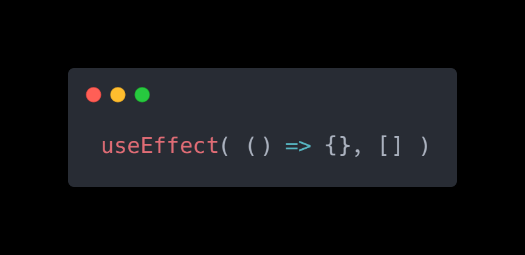

# Tại sao nên dùng Effect

Bạn có thể đang tự hỏi, tại sao chúng ta cần sử dụng hook useEffect? Tại sao chúng ta không gọi document.title = "..." ở bất kỳ chỗ nào trong câu lệnh component trước câu lệnh return?

 

<ToggleTOC />

## I. Cách useEffect hoạt động

```jsx
import {useState, useEffect} from "react";

function Counter() {
    const [counter, setCounter] = useState(0);

    useEffect(() => {
        document.title = `Counter is ${counter}`;
    });
    
    return <button onClick={() => setCounter(prevCounter => prevCounter + 1)}>
        Click me {counter}
    </button>
}
```

Chúng ta sẽ phân tích đoạn code để hiểu rõ hơn cách useEffect hoạt động.

Khi bạn gọi useEffect, bạn đang thông báo cho React rằng component cần thực hiện một số công việc sau mỗi lần hiển thị.

React sẽ lưu trữ hàm được truyền vào, trong ví dụ này là hàm cập nhật `document.title` và sau đó gọi nó sau khi hoàn tất việc cập nhật DOM của component này.

## II. Ôn lại closures

`useEffect` được đặt bên trong component có chủ ý để bạn có thể dễ dàng sử dụng các biến hiện có trong đó (đặc biệt là các biến trạng thái).

Lưu ý rằng vì `useEffect` được gọi bên trong hàm `Counter`, bạn có thể truy cập tất cả các biến trong hàm cha (`Counter`) thông qua việc sử dụng closures. Trong ví dụ này, chúng ta có thể truy cập biến `counter`.

Và mỗi khi `useEffect` được gọi, chúng ta có thể đảm bảo rằng chúng ta có giá trị mới nhất của trạng thái đó. Trong ví dụ này là `counter`.

## III. Các nguyên tắc khi làm việc với Hook

Hãy luôn ghi nhớ Các nguyên tắc khi làm việc với hook.

**Quy tắc 1: Chỉ gọi Hook từ các hàm React**

Bạn chỉ có thể sử dụng `useEffect` bên trong một hàm React.

**Quy tắc 2: Chỉ gọi Hook ở Cấp độ trên cùng**

Không bao giờ gọi hook bên trong vòng lặp, điều kiện hoặc các hàm lồng nhau.

Đây là quy tắc quan trọng nhất và việc vi phạm quy tắc này có thể gây ra các lỗi không mong muốn.

Tương tự như việc không được phép đóng gói useState bằng điều kiện if, bạn cũng không nên đóng gói useEffect bằng điều kiện if.

Tuy nhiên, việc có một điều kiện if bên trong hàm useEffect là hoàn toàn hợp lệ.

Vì vậy, đoạn code sau là không chính xác:

```jsx
// pseudo-code
function App() {
    if (someState >= 0) {
        useEffect(() => {
            // THIS IS INCORRECT 👎
        })
    }
}
```

Thay vào đó, điều kiện if nên được đặt bên trong cuộc gọi useEffect:

```jsx
// pseudo-code
function App() {
    useEffect(() => {
        if (someState >= 0) {
            // this is okay 👍
        }
    });
}
```

Hãy đảm bảo đặt tất cả các cuộc gọi hook ở đầu hàm để tránh gặp lỗi không mong đợi.

## IV. Tránh vòng lặp vô hạn

Một lỗi phổ biến:

```jsx
useEffect(() => {
  setCounter(counter + 1);
});
```

Gây vòng lặp render không dứt vì setCounter làm thay đổi state → render lại → chạy lại useEffect.

**Cách sửa:**

```jsx
useEffect(() => {
  document.title = `Counter is ${counter}`;
}, [counter]); // Chỉ chạy khi counter thay đổi
```

## V. Tại sao chúng ta cần sử dụng hook useEffect

Bạn có thể đang tự hỏi, tại sao chúng ta cần sử dụng hook `useEffect`? Tại sao chúng ta không gọi document.title = "..." ở bất kỳ chỗ nào trong câu lệnh component trước câu lệnh return?

Mặc dù điều đó là khả thi nhưng bạn không được khuyến khích thực hiện vì nhiều lý do.

Một trong những lý do chính là hiệu suất. Các component nên được hiển thị rất nhanh, cho phép ứng dụng tiếp tục hiển thị rất nhanh. Ngoài ra, code trước câu lệnh return chạy trước khi JSX được tạo ra từ component. Mặt khác, code trong hook useEffect chỉ chạy sau khi component đã được hiển thị vào DOM.

Còn một lý do quan trọng khác liên quan đến các hiệu ứng yêu cầu dọn dẹp.

:::tip[Tóm lại]

- Hãy luôn ghi nhớ Các nguyên tắc khi làm việc với hook.
- Quy tắc 1: Chỉ gọi Hook từ các hàm React
- Quy tắc 2: Chỉ gọi Hook ở Cấp độ trên cùng và không bao giờ gọi hook bên trong vòng lặp, điều kiện hoặc các hàm lồng nhau.

:::

<iframe width="560" height="315" src="https://www.youtube.com/embed/l-j6EBnnxCw?rel=0" title="YouTube video player" frameborder="0" allow="accelerometer; autoplay; clipboard-write; encrypted-media; gyroscope; picture-in-picture; web-share" referrerpolicy="strict-origin-when-cross-origin" allowfullscreen></iframe>

## FAQ - Câu hỏi thường gặp khi phỏng vấn

---

### Câu 1: Tại sao chúng ta cần sử dụng useEffect thay vì đặt code trực tiếp trong component?

Mặc dù có thể đặt code thay đổi hiệu ứng phụ (ví dụ: document.title = "...") trực tiếp trong component trước câu lệnh return, nhưng điều này không được khuyến khích vì nhiều lý do. 

Thứ nhất là về hiệu suất: các component nên được hiển thị rất nhanh, và code trước return chạy trước khi JSX được tạo. Ngược lại, code trong useEffect chỉ chạy sau khi component đã được hiển thị vào DOM, giúp ứng dụng duy trì tốc độ hiển thị nhanh chóng. 

Thứ hai, useEffect cung cấp cơ chế để xử lý các hiệu ứng yêu cầu dọn dẹp (cleanup), điều này rất quan trọng để tránh rò rỉ bộ nhớ hoặc các lỗi khác.

### Câu 2: useEffect có thể truy cập các biến trạng thái (state variables) trong component cha không?

Có, useEffect được đặt bên trong component có chủ ý để bạn có thể dễ dàng sử dụng các biến hiện có trong đó, đặc biệt là các biến trạng thái. 

Nhờ việc sử dụng closures, useEffect có thể truy cập tất cả các biến trong hàm cha (component). Điều này đảm bảo rằng mỗi khi useEffect được gọi, nó sẽ truy cập được giá trị mới nhất của trạng thái đó.

### Câu 3: useEffect liên quan đến closures như thế nào?

useEffect được gọi bên trong component, cho phép nó truy cập tất cả các biến (bao gồm cả biến trạng thái và props) trong phạm vi của component đó thông qua cơ chế closure. 

Điều này có nghĩa là khi hàm trong useEffect được thực thi, nó sẽ có quyền truy cập vào các giá trị của biến tại thời điểm hàm đó được tạo, và mỗi khi useEffect được gọi, bạn có thể đảm bảo rằng bạn có giá trị mới nhất của trạng thái đó.