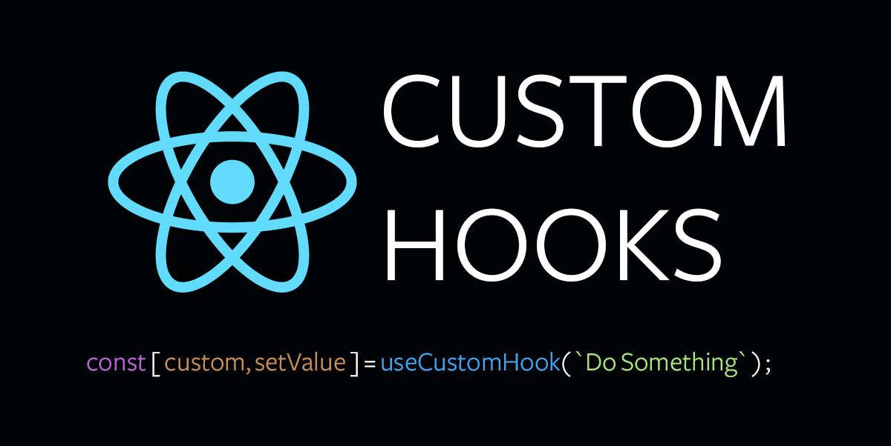

# Custom useFetch Hook

Bạn có thể nhận thấy rằng code `fetch` thường rất dài, điều này làm cho component phức tạp hơn mức cần thiết. Đó là một trong những lý do tại sao chúng ta sẽ tạo `hook` tùy chỉnh `useFetch` để đơn giản hóa logic `fetch` Điều này cũng giúp chúng ta tránh những lỗi phổ biến khi làm việc với `fetch`, vì tất cả logic `fetch` đều được đặt trong hook tùy chỉnh `useFetch`.

 

<ToggleTOC />

## I. Code Fetch thông thường

Hook tùy chỉnh `useFetch` sẽ trả về một hàm get và một hàm post. Chúng ta sẽ bắt đầu với hàm get.

Hàm `get` cho phép chúng ta thực hiện các yêu cầu `get`. Khi hook tùy chỉnh `useFetch` được xây dựng, đây là cách bạn sử dụng nó:


```jsx
useEffect(() => {
    fetch("https://jsonplaceholder.typicode.com/users")
    .then(response => response.json())
    .then(data => {
        console.log(data);
    })
    .catch(error => console.log(error));
}, []);
```

## II. Code Fetch với Custom Hook

```jsx
// useFetch.js

export default function useFetch(baseUrl) {
  async function get(endpoint = "") {
    try {
      const response = await fetch(baseUrl + endpoint);
      if (!response.ok) {
        throw new Error("Network response was not ok");
      }
      const data = await response.json();
      return data;
    } catch (err) {
      throw err;
    }
  }

  return { get };
}

```

## III. Sử dụng Custom Hook

```jsx
const { get } = useFetch("https://jsonplaceholder.typicode.com");

useEffect(() => {
    get("/users")
        .then(data => console.log(data))
        .catch(error => console.log(error));
}, []);
```

Lưu ý rằng:

- Hàm `useFetch` trả về một đối tượng với hàm `get`. Chúng ta sử dụng object destructuring để truy cập vào hàm `get`.
- Hàm `useFetch` nhận tham số `baseUrl`, cho phép ta gọi `get("/users")` sau đó mà không cần lặp lại URL cơ sở dài.
- `get("/users")` tự động chuyển đổi phản hồi thành JSON. Chúng ta không cần phải làm điều đó nữa vì chúng ta có thể ngay lập tức xử lý promise và đọc data.

:::tip[Tóm lại]

- Hook tùy chỉnh `useFetch` giúp đơn giản hóa logic gửi yêu cầu `fetch`.
- Hook tùy chỉnh `useFetch` sẽ trả về hai hàm `get` và `post`, sử dụng object destructuring.
- Hook tùy chỉnh `useFetch` nhận `baseUrl` làm tham số duy nhất.
- Hàm `get` sẽ nhận `url` mà bạn muốn gửi yêu cầu `fetch` và `url` này sẽ được thêm vào `baseUrl`.

:::

## FAQ - Câu hỏi thường gặp khi phỏng vấn

---

### Câu 1. Tại sao chúng ta cần tạo custom hook useFetch? 

Vì code fetch thông thường thường dài và lặp lại, khiến component phức tạp hơn mức cần thiết. Custom hook giúp gom logic fetch vào một nơi, làm code gọn gàng, dễ tái sử dụng và giảm lỗi.

### Câu 2. useFetch trả về những gì?

Trong ví dụ này, useFetch trả về một đối tượng chứa hàm get. Hàm này dùng để thực hiện các yêu cầu GET tới API.

### Câu 3. Tại sao ta chỉ cần viết `get("/users")`?

Vì baseUrl đã được truyền vào hook, nên ta chỉ cần thêm endpoint /users. Hook sẽ tự động nối baseUrl + endpoint để tạo URL đầy đủ.

### Câu 4. Hàm get trong useFetch xử lý dữ liệu như thế nào?

Hàm get gọi fetch, kiểm tra phản hồi (response.ok), sau đó chuyển đổi dữ liệu sang JSON và trả về. Nhờ vậy, ta không cần viết .then(response => response.json()) trong component nữa.