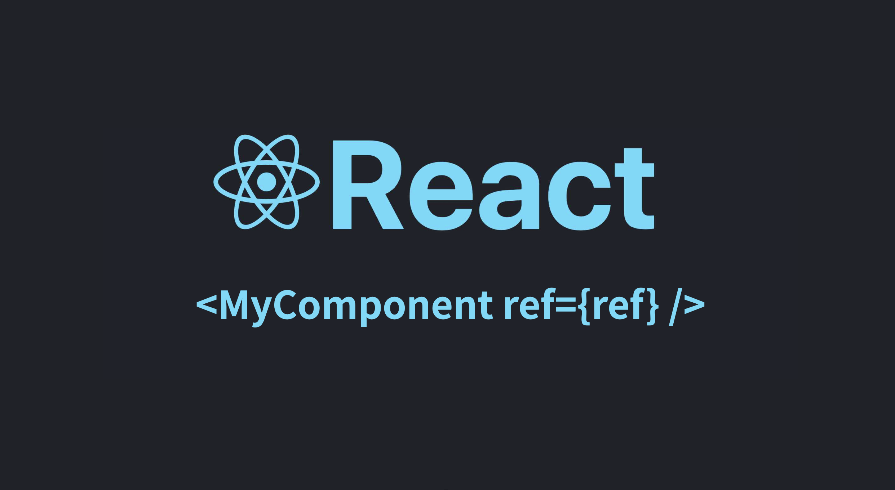

# Giới thiệu về Refs

Trong React, ref (viết tắt của reference) là một cơ chế cho phép bạn tạo ra một “tham chiếu” đến một DOM element hoặc một component, để có thể truy cập trực tiếp và thao tác với nó mà không cần thông qua props hay state.

 

<ToggleTOC />

## I. Tại sao cần ref?

Hãy giả sử bạn có component sau và bạn muốn đặt trọng tâm vào trường nhập liệu khi component được hiển thị lần đầu tiên.

```jsx
import {useEffect} from "react";

function App() {
    useEffect(() => {
        // how do you focus the input?
    }, []);

    return <input type="text" />;
}
```

Lưu ý: Phương thức `.focus()` trên các phần tử `<input>` là một phương thức đặt con trỏ của người dùng vào trường nhập liệu. Ví dụ, khi bạn mở `https://google.com`, ô tìm kiếm sẽ được tập trung và trỏ nhắm tự động được đặt trong ô đó.

Bạn có thể nghĩ đến việc sử dụng `document.querySelector()` để tìm `<input type="text" />` nhưng đây không phải là cách khuyên dùng vì một số lý do sau:

- Phương thức có thể không hoạt động (cụ thể là khi trường nhập liệu chưa được hiển thị, hãy nhớ rằng React tạo ra các phần tử React tạo thành DOM ảo và sau đó hiển thị chúng lên DOM thực của trình duyệt).

- Ngay cả khi phương thức hoạt động, bạn có thể nhận được kết quả không đồng nhất khi tiếp tục phát triển ứng dụng. Ví dụ: bạn sử dụng lại component đó nhiều lần trong ứng dụng.

Giải pháp cho vấn đề này là sử dụng `ref` của `React`. `Ref` cho phép bạn giữ một tham chiếu đến phần tử DOM đã được hiển thị. Sau khi tạo ra `ref` và gán nó cho một phần tử React trong JSX, bạn có thể gọi các phương thức mệnh lệnh trên phần tử DOM đã được hiển thị, chẳng hạn như `.focus()`.

## II. Có nên áp dụng ref không?

React chỉ coi việc sử dụng `ref` như phương án cứu cánh (giải pháp cuối cùng mà bạn có thể nghĩ đến). Bạn có thể xây dựng một dự án hoàn chỉnh mà không sử dụng (hoặc chỉ sử dụng rất ít) `refs` và điều đó hoàn toàn không có vấn đề.

## III. Ứng dụng thực tế

<iframe src="https://codesandbox.io/embed/vhvr9c?view=editor+%2B+preview"
     title="ref-basic"
     allow="accelerometer; ambient-light-sensor; camera; encrypted-media; geolocation; gyroscope; hid; microphone; midi; payment; usb; vr; xr-spatial-tracking"
     sandbox="allow-forms allow-modals allow-popups allow-presentation allow-same-origin allow-scripts"
   ></iframe>

```jsx
import {useRef} from "react";

function App() {
    const inputRef = useRef();

    return <input ref={inputRef} type="text" />;
}
```

Sau khi gán `inputRef` cho `<input />` bằng `ref={inputRef}`, chúng ta có thể truy cập vào phần tử DOM đã được hiển thị với `inputRef.current`.

Sau đó, bất cứ khi nào bạn muốn tập trung vào phần tử `input`, bạn có thể gọi `inputRef.current.focus()`. Vì vậy, kết quả cuối cùng sẽ như sau:

```jsx
import {useRef, useEffect} from "react";

function App() {
    const inputRef = useRef();

    useEffect(() => {
        inputRef.current.focus();
    }, []);

    return <input ref={inputRef} type="text" />;
}
```


:::tip[Tóm lại]

- `document.querySelector()` không nên được sử dụng trong React vì nó có thể dẫn đến kết quả không mong đợi.
- Chỉ sử dụng `refs` như một biện pháp cuối cùng để tìm một phần tử cụ thể đã được hiển thị trên DOM bằng React và thực hiện các thao tác trên nó.

:::


## FAQ - Câu hỏi thường gặp khi phỏng vấn

---

### Câu 1. Ref trong React là gì?

Ref (reference) là một cơ chế cho phép bạn tạo ra một tham chiếu đến một DOM element hoặc một component, để có thể truy cập trực tiếp và thao tác với nó mà không cần thông qua props hay state.

### Câu 2. Tại sao không nên dùng document.querySelector() để thao tác với phần tử trong React?

Vì React sử dụng DOM ảo (Virtual DOM). Nếu bạn gọi `document.querySelector()` khi phần tử chưa được render, nó có thể không hoạt động. Ngoài ra, khi tái sử dụng component nhiều lần, việc truy vấn trực tiếp DOM có thể dẫn đến kết quả không đồng nhất.

### Câu 3. Làm thế nào để đặt con trỏ vào ô input khi component được render lần đầu tiên?

Bạn có thể dùng useRef để tạo ref cho input, sau đó gọi `inputRef.current.focus()` trong useEffect

### Câu 4. Khi nào nên sử dụng ref trong React?

Ref chỉ nên được dùng như giải pháp cuối cùng khi bạn cần thao tác trực tiếp với DOM (ví dụ: focus input, play/pause video, đo kích thước phần tử). Trong hầu hết các trường hợp, bạn có thể xây dựng ứng dụng mà không cần ref.

### Câu 5. Sau khi gán ref cho một phần tử, bạn truy cập phần tử đó như thế nào?

Sau khi gán ref cho phần tử bằng `ref={inputRef}`, bạn có thể truy cập phần tử DOM đã render thông qua inputRef.current.

