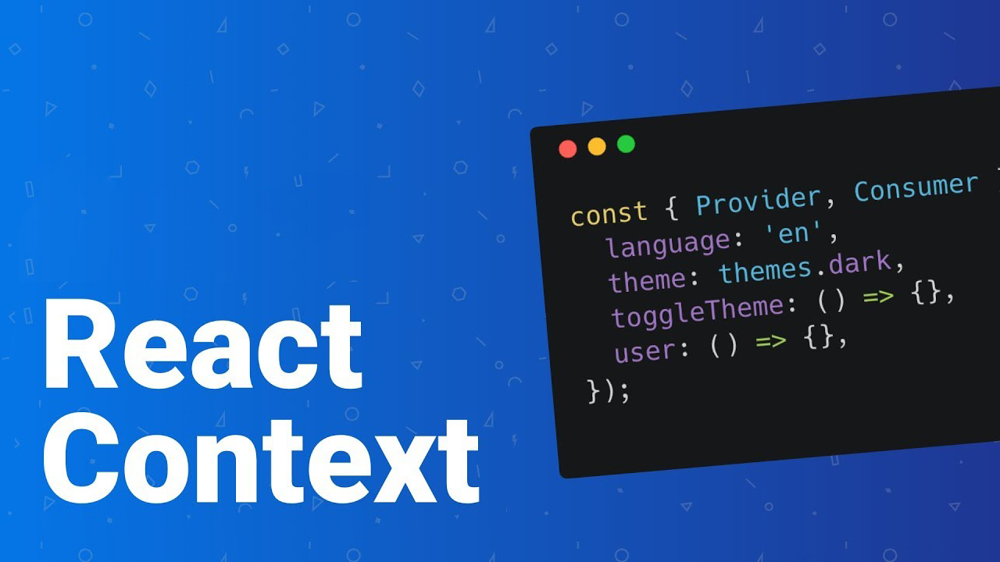

# Giá trị Context

Giá trị của provider trong context không nhất thiết phải là chuỗi. Nó có thể là một mảng hoặc đối tượng.

 

<ToggleTOC />

## I. Context trả về một giá trị chuỗi

```jsx
function ThemeProvider(props) {
  const theme = "dark";

  return (
    <ThemeContext.Provider value={theme}> /* value is a string (in this example) */
      {props.children}
    </ThemeContext.Provider>
  );
};
```

Tuy nhiên, bạn cũng có thể định nghĩa context trả về một mảng hoặc đối tượng!

Lợi ích của việc trả về đối tượng là bạn có thể trả về nhiều giá trị đồng thời. 

Ví dụ, bạn có thể truyền nhiều thông tin người dùng (như họ, tên, vv.).

Ngoài ra, việc trả về đối tượng cũng cho phép bạn truyền hàm làm một trong các mục nhập của đối tượng đó

## II. Context trả về đối tượng

Ví dụ, chúng ta có thể truyền đối tượng sau:

```jsx
{
    theme: "dark",
    toggleTheme: function() {
        // a function that toggles the theme
    }
}
```

Dưới đây là cách tạo context:

```jsx
import { createContext } from "react";

const ThemeContext = createContext();

function ThemeProvider(props) {
  const theme = "dark";

  function toggleTheme() {
    // toggle the theme here
  }

  const value = {
    theme: theme,
    toggleTheme: toggleTheme
  }

  return (
    <ThemeContext.Provider value={value}>
      {props.children}
    </ThemeContext.Provider>
  );
};

export { ThemeContext, ThemeProvider };
```

Lưu ý `<ThemeContext.Provider />` vẫn nhận cùng `value={}`, nhưng thay vì truyền một chuỗi, chúng ta bây giờ đang truyền một đối tượng.

:::tip[Tóm lại]

- Lợi ích của việc trả về đối tượng là bạn có thể trả về nhiều giá trị đồng thời.
- Lợi ích khác của việc trả về đối tượng là bạn có thể trả về hàm dưới dạng một trong các mục nhập của đối tượng đó.
- Một ví dụ thực tế là trả về một đối tượng chứa chủ đề và một hàm chuyển đổi chủ đề.

:::

## FAQ - Câu hỏi thường gặp khi phỏng vấn

---

### Câu 1. Trong React, giá trị value của Context.Provider có bắt buộc phải là chuỗi không?

Không, giá trị value của Context.Provider không nhất thiết phải là chuỗi. Nó có thể là một mảng hoặc đối tượng.

### Câu 2. Lợi ích của việc truyền một đối tượng làm giá trị context là gì?

Lợi ích của việc truyền một đối tượng làm giá trị context là bạn có thể trả về nhiều giá trị đồng thời.

### Câu 3. Nếu muốn truyền cả theme và một hàm đổi theme, ta nên dùng kiểu dữ liệu nào cho value?

Ta nên dùng kiểu dữ liệu object cho value.